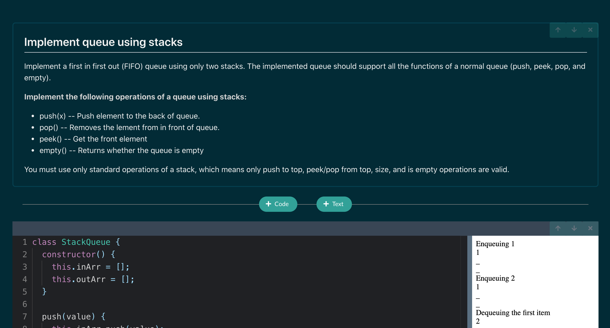

### What is Ecmanote?

ecmanote is a cli that allows you to write notes in markdown and run javascript, all live within your browser. Great for studying and practicing data structures and algorithms!

One can choose what file is created (and subsequently accessed at a later time) in the directory by adding an optional parameter `ecmanote serve example.js` to either create example.js or access example.js if it has already been created in that directory.

The port can also be defined by writing `--port=5000`. Default port is 4005.

Example usage:

`mkdir ds&a-notes`

`cd ds&a-notes`

`ecmanote serve hashtables.js`

### Known bugs:

- Be careful writing while loops, or writing anything else that could cause an infinite loop. I am working on a solution, but in the meantime, I recommend having two concurrent sessions open, one for working, and one to copy and paste what you write into in case the first file becomes corrupted. For example, I would write `ecmanote serve hashtables-bu.js --port=4006` to hold what I know works just in case.
